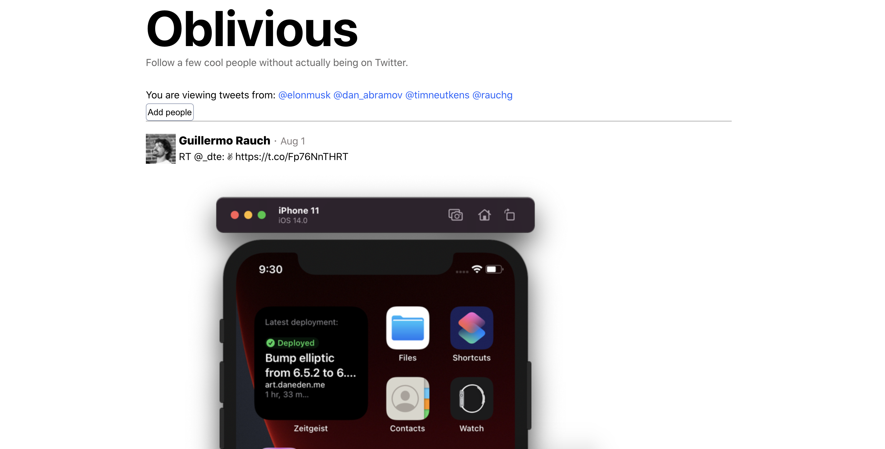

# oblivious

This is an ongoing project. I currently have a couple people I have hardcoded but I would like to expand this site so that there is auth and people can add their own followers.

### Motivation

I want to see tweets from a couple people without dealing with Twitter (trending section, annoying replies, seeing what my followers "like", etc). This is exactly what this website does. I named it oblivious because I'd rather be oblivious to what is trending and the random annoying opinions of people that somehow creep into my twitter feed (like when someone I follow likes a tweet of someone I don't follow and still shows up somehow).
